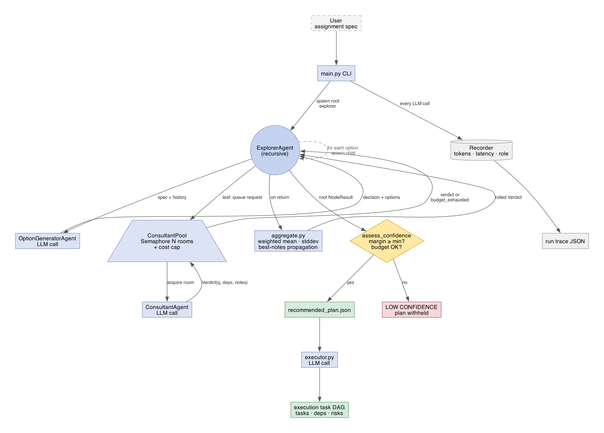
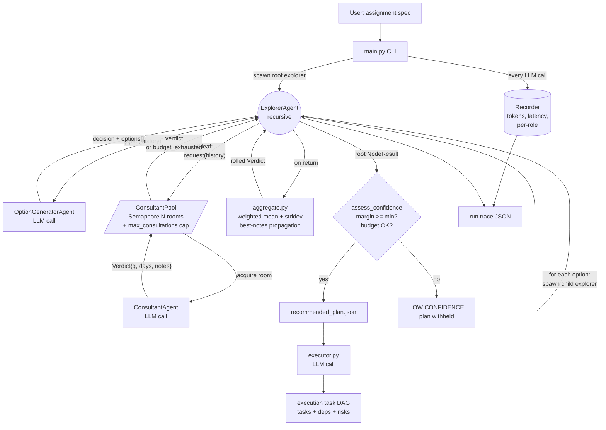
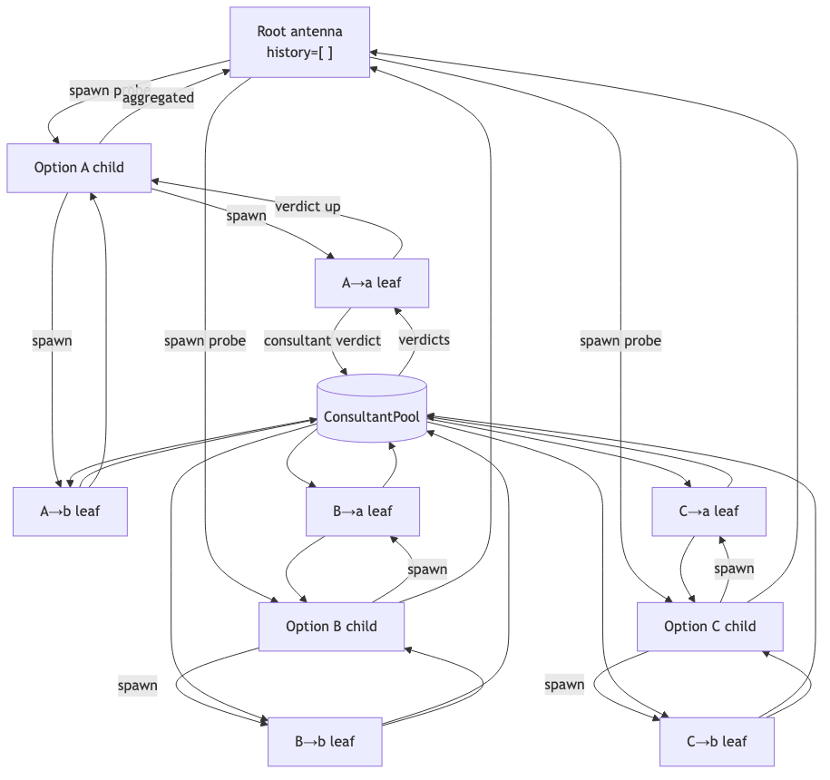

# Architecture diagram

Rendered PNGs: `arch_component.png` (component/coordination view) and
`arch_flow.png` (probe/antenna information-flow view) are in `docs/`.
The PDF is built from those images — see the pandoc command at the bottom.

## Component / coordination view





## Information-flow view (probe / antenna mental model)



```mermaid
flowchart TB
    Root[Root antenna<br/>history=[]] -->|spawn probe| O1[Option A child]
    Root -->|spawn probe| O2[Option B child]
    Root -->|spawn probe| O3[Option C child]

    O1 -->|spawn| O1a[A→a leaf]
    O1 -->|spawn| O1b[A→b leaf]
    O2 -->|spawn| O2a[B→a leaf]
    O2 -->|spawn| O2b[B→b leaf]
    O3 -->|spawn| O3a[C→a leaf]
    O3 -->|spawn| O3b[C→b leaf]

    O1a -->|consultant verdict| Pool[(ConsultantPool)]
    O1b --> Pool
    O2a --> Pool
    O2b --> Pool
    O3a --> Pool
    O3b --> Pool

    Pool -->|verdicts| O1a
    Pool --> O1b
    Pool --> O2a
    Pool --> O2b
    Pool --> O3a
    Pool --> O3b

    O1a -->|verdict up| O1
    O1b --> O1
    O2a --> O2
    O2b --> O2
    O3a --> O3
    O3b --> O3

    O1 -->|aggregated| Root
    O2 --> Root
    O3 --> Root
```

## Coordination notes

- **Fan-out** is implemented with `asyncio.gather`; thousands of
  in-flight explorer coroutines are cheap.
- **Bottleneck and backpressure** live in the consultant pool. The
  semaphore caps in-flight LLM calls; `max_consultations` caps total
  cost. Both the explorer tree and any future executor wait at
  this single chokepoint.
- **Aggregation** happens at every antenna on its way back up. The
  rolled `Verdict` is consultation-weighted so deeper subtrees get
  proportional influence, and the best leaf's feasibility notes are
  preserved up the chain so reviewers see real consultant text at
  the root.
- **Governance** is a pure function (`assess_confidence`) over the
  root's branches plus the propagated `budget_exhausted` flag — it
  never mutates the tree, only decides whether to publish a
  recommendation downstream.

## Human-in-the-loop points

- The user picks `--rooms`, `--depth`, `--options`,
  `--max-consultations`, `--min-margin` per run.
- The user reviews the per-option breakdown printed at the end and
  the JSON trace before passing the recommended plan to the executor.
- The executor's task DAG is intended for human review before any
  downstream agent is allowed to execute it.
